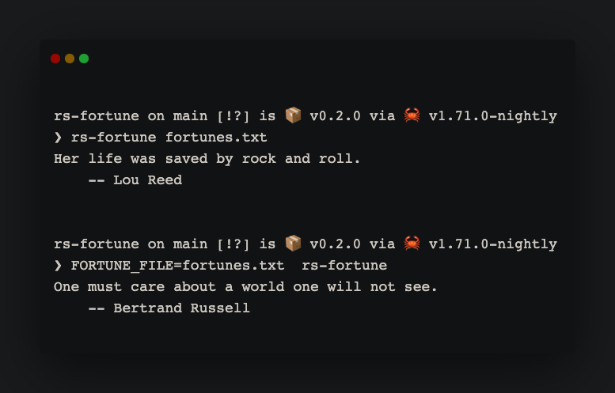

# rs-fortune

## Document

```txt
rs-fortune

Usage:
  rs-fortune [/path/to/fortune/cookie/file]
  rs-fortune -h|--help

If the fortune cookie file path is omitted, the contents of environment
variable FORTUNE_FILE will be used. If neither is available, fortune will abort.
```

## Useage

1. download fortune file

    ```shell
    curl https://github.com/ruanyf/fortunes/raw/master/data/fortunes -l -o fortunes.txt
    ```

2. run rs-fortune

      ```shell
      rs-fortune fortunes.txt
      ```

      or

      ```shell
      FORTUNE_FILE=fortunes.txt rs-fortune
      ```

3. result

    
